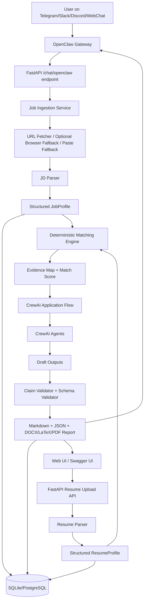
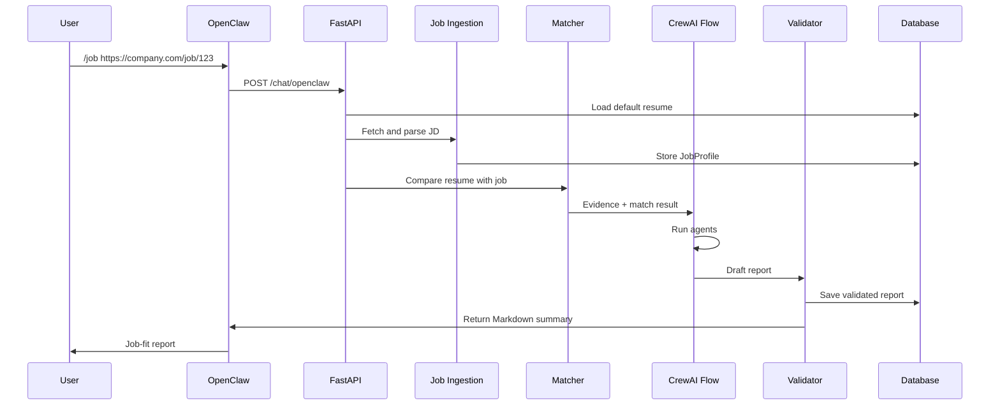

# 03 - System Architecture

## High-level architecture



## Runtime flow

### Flow A - Resume upload

1. User uploads resume through API/UI.
2. File is stored locally.
3. Parser extracts raw text.
4. Resume parser creates structured sections.
5. Skill extractor identifies explicit skills.
6. Resume facts receive stable IDs.
7. System stores `ResumeProfile`.
8. Low-confidence fields are flagged.

### Flow B - Job analysis from OpenClaw

1. User sends `/job <url>`.
2. OpenClaw routes command to local skill.
3. Skill calls FastAPI `/chat/openclaw`.
4. Backend authenticates token and sender.
5. Job ingestion fetches URL, uses browser fallback only for public JavaScript-rendered pages, or asks for pasted text if blocked.
6. JD parser creates `JobProfile`.
7. Matching engine compares resume and JD.
8. CrewAI Flow runs bounded agents.
9. Validator removes unsupported claims.
10. Report is saved and returned to chat.

## API surface

### Health

```http
GET /health
```

```http
GET /ready
```

`/health` is process liveness. `/ready` verifies database connectivity and, for
production, confirms the database is at the current Alembic migration head.

### Resume upload

```http
POST /resumes/upload
Content-Type: multipart/form-data
```

Response:

```json
{
  "resume_id": 1,
  "candidate_name": "Aarav Sharma",
  "status": "parsed",
  "warnings": []
}
```

```http
DELETE /resumes/{resume_id}
```

### Job analysis

```http
POST /jobs/analyze
```

Request:

```json
{
  "resume_id": 1,
  "job_url": "https://company.com/jobs/software-engineer",
  "job_text": null,
  "company": null,
  "role": null
}
```

Response:

```json
{
  "analysis_id": 101,
  "report_id": 501,
  "match_score": 78,
  "status": "completed"
}
```

### OpenClaw endpoint

```http
POST /chat/openclaw
Authorization: Bearer <JOBCOPILOT_API_TOKEN>
```

Request:

```json
{
  "command": "job",
  "args": "https://company.com/jobs/software-engineer",
  "sender": "telegram:12345",
  "session_id": "telegram:slash:12345"
}
```

### Report retrieval

```http
GET /reports/{report_id}
GET /reports/{report_id}/markdown
GET /reports/{report_id}/trace
GET /reports/{report_id}/resume/latex
GET /reports/{report_id}/resume/docx
GET /reports/{report_id}/resume/pdf
DELETE /reports/{report_id}
```

The trace endpoint returns the workflow mode, step statuses, step summaries,
validation warning codes, optional `duration_ms` telemetry for the full workflow
plus each step, and optional live-runtime metadata. Live CrewAI traces include
provider/model fields, token usage when CrewAI exposes it, `cost_estimate_usd`
when a configured provider/model/region pricing source matches the trace, and
runtime metadata describing the pricing source. These fields are additive
observability metadata; they must not change the evidence-first report content
and older persisted traces without the optional fields remain valid.

### Audit and retention

```http
GET /audit/events
POST /retention/purge
```

Audit events store sanitized metadata for uploads, analyses, exports, deletes,
and retention purges. Retention purge is controlled by `DATA_RETENTION_DAYS`
and removes expired resumes, reports, orphan jobs, and uploaded files.

## Data model

### ResumeProfile

```json
{
  "resume_id": 1,
  "candidate": {
    "name": "string",
    "email": "string",
    "location": "string",
    "links": ["string"]
  },
  "skills": [
    {
      "name": "FastAPI",
      "category": "backend",
      "evidence_ids": ["skill_001", "project_002"]
    }
  ],
  "experience": [],
  "projects": [],
  "education": [],
  "certifications": [],
  "facts": [
    {
      "id": "project_002",
      "text": "Built an API using FastAPI and PostgreSQL",
      "section": "projects"
    }
  ]
}
```

### JobProfile

```json
{
  "job_id": 10,
  "company": "NovaHire AI",
  "role": "Software Engineer - AI Platform",
  "required_skills": [
    {
      "name": "Python",
      "importance": "required",
      "evidence_text": "Strong Python experience required"
    }
  ],
  "preferred_skills": [],
  "responsibilities": [],
  "experience_level": "0-2 years",
  "keywords": []
}
```

### MatchResult

```json
{
  "score": 78,
  "matched_skills": [],
  "missing_required_skills": [],
  "weak_skills": [],
  "resume_evidence_map": {},
  "job_evidence_map": {},
  "confidence": "high"
}
```

## Deployment architecture

### Local MVP

```text
OpenClaw local gateway
FastAPI on 127.0.0.1:8000
SQLite database
Local file storage
LLM provider API
```

### Production-lite

```text
Nginx reverse proxy
FastAPI API container
Worker container
PostgreSQL
Redis
S3-compatible file storage
Prometheus + logs
OpenClaw gateway per trusted user/team boundary
```

## Sequence diagram


