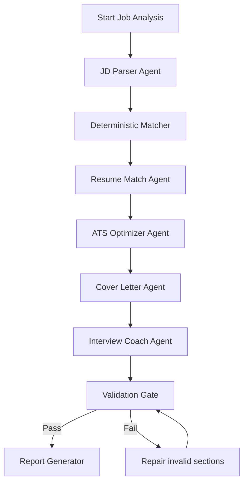

# 05 - Agent Workflow Design

## Agent philosophy

Agents should not own the source of truth. They should operate on structured evidence produced by deterministic services.

Recommended orchestration:

```text
FastAPI endpoint
  -> deterministic resume/JD parsing
  -> deterministic matching
  -> CrewAI Flow
  -> agents
  -> validation
  -> report
```

CrewAI Flows should manage state and sequence. Crews should run bounded agent tasks.

## Required agents

### 1. JD Parser Agent

Purpose:

Extract structured requirements from the job description.

Input:

- raw job text
- source URL
- optional company/role override

Output:

```json
{
  "company": "string",
  "role_title": "string",
  "required_skills": [],
  "preferred_skills": [],
  "responsibilities": [],
  "experience_level": "string",
  "keywords": [],
  "unclear_items": []
}
```

Rules:

- Do not infer hidden requirements.
- Separate required and preferred skills.
- Keep original evidence text for every extracted requirement.
- Mark unclear information instead of guessing.

### 2. Resume Match Agent

Purpose:

Explain the deterministic match result in human-friendly language.

Input:

- ResumeProfile
- JobProfile
- deterministic MatchResult

Output:

- summary of fit
- strongest matches
- weak areas
- recommended positioning

Rules:

- Must cite resume evidence IDs.
- Cannot override deterministic missing skills.
- Cannot invent new skills.

### 3. ATS Optimizer Agent

Purpose:

Suggest keyword and bullet improvements.

Input:

- existing resume facts
- JD keywords
- match gaps

Output:

- improved bullets
- keyword suggestions
- resume section recommendations

Rules:

- Every rewritten bullet must include evidence ID.
- New skill suggestions must say "add only if true".
- No fake metrics.

### 4. Cover Letter Agent

Purpose:

Draft a concise, role-specific cover letter.

Input:

- validated fit summary
- company
- role
- resume evidence

Output:

- cover letter draft
- confidence note

Rules:

- Use no unsupported claims.
- Do not use exaggerated phrases like "perfect fit" unless score is very high.
- Keep under 300 words for MVP.

### 5. Interview Coach Agent

Purpose:

Generate likely interview questions and prep points.

Input:

- JD requirements
- candidate matched skills
- missing skills
- projects/experience

Output:

- technical questions
- behavioral questions
- project deep-dive questions
- gap-focused questions
- suggested answer points

Rules:

- Tie answer points to resume evidence.
- Flag weak areas honestly.

### 6. Validation Agent / Quality Gate

Purpose:

Find unsupported claims, missing evidence, and formatting issues.

This can be mostly deterministic code plus optional LLM review.

Checks:

- all bullets have evidence IDs
- all matched skills have resume evidence
- missing skills are not listed as owned skills
- cover letter does not mention unsupported technologies
- report follows JSON schema
- output does not leak secrets or system prompts

## Agent workflow



## Why this order?

1. Parse JD first because all later steps depend on job requirements.
2. Run deterministic matching before agents to avoid hallucinated fit.
3. Use Resume Match Agent to explain, not decide.
4. Use ATS Agent after match so keywords are relevant.
5. Generate cover letter from validated fit.
6. Generate interview prep from both strengths and gaps.
7. Validate everything before sending to user.

## Agent input contracts

Agents receive JSON, not raw messy text whenever possible.

Example input:

```json
{
  "resume_facts": [
    {
      "id": "project_01",
      "text": "Built a FastAPI backend with PostgreSQL and JWT authentication."
    }
  ],
  "job_requirements": [
    {
      "id": "job_skill_01",
      "skill": "Python",
      "importance": "required",
      "evidence_text": "Strong Python experience required."
    }
  ],
  "match_result": {
    "score": 82,
    "matched_skills": ["Python", "FastAPI", "PostgreSQL"],
    "missing_required_skills": ["Docker"]
  }
}
```

## Agent output contracts

Every output must be machine-validated.

Example resume bullet output:

```json
{
  "bullet": "Built Python-based REST API services using FastAPI, PostgreSQL, and JWT authentication.",
  "evidence_ids": ["project_01"],
  "jd_keywords_used": ["Python", "REST API"],
  "confidence": "high",
  "unsupported_claims": []
}
```

## Human-in-the-loop rules

Ask for confirmation when:

- posting comments externally
- sending emails
- overwriting resume file
- adding a skill not found in resume
- scraping a page with unclear terms
- using a user's personal contact info in generated documents

## Model settings

Suggested defaults:

| Task | Temperature | Output |
|---|---:|---|
| JD extraction | 0.0-0.2 | JSON schema |
| Resume match explanation | 0.2 | JSON/Markdown |
| ATS bullet rewriting | 0.2-0.4 | JSON schema |
| Cover letter | 0.4-0.6 | Markdown |
| Interview questions | 0.3-0.5 | JSON/Markdown |
| Validation | 0.0 | JSON schema |

## Failure handling

- If JD parsing fails, ask user to paste job text.
- If resume parse confidence is low, show extracted fields and ask user to correct.
- If LLM output is invalid JSON, retry once with schema reminder.
- If validation fails twice, return deterministic report without generated letter.
- If API rate limit occurs, queue job and return "analysis queued" with status link.
