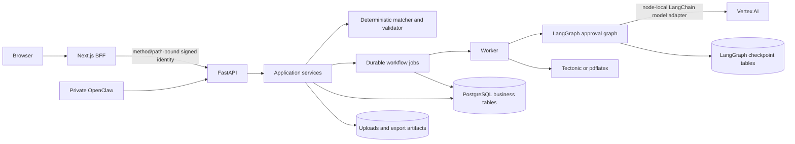

# Architecture, code, data, and reliability audit

## Repository map

The first-party implementation is a modular monorepo:

| Area | Responsibility |
|---|---|
| `Frontend/` | Next.js 16 App Router dashboard, Clerk/local/trusted-header auth, authenticated BFF routes, Playwright E2E |
| `Backend/` | FastAPI API, SQLAlchemy models/repositories, deterministic analysis, durable operations, LangGraph approval, privacy and export services |
| `Ai services/openclaw/` | Private OpenClaw workspace, `/job` skill, local Vertex gateway setup, backend bearer client |
| `Docs/` | Product specifications, business rules, architecture notes, deployment runbook, this audit |
| `.github/workflows/ci.yml` | Backend/frontend/OpenClaw, migration, dependency, browser, container, and Compose gates |
| `docker-compose.yml` | Local production-like PostgreSQL, migrator, API, worker, and frontend topology |

The audit counted 126 first-party backend Python files, 67 frontend TypeScript/
TSX/MTS files, and 10 first-party OpenClaw files. The history contains 37
commits from 2026-07-08 through 2026-07-10 and one contributor. This is enough
to identify hotspots, not enough to infer a stable delivery trend. The main
hotspots are `dashboard-shell.tsx` (about 1,975 lines),
`workflow_job_service.py` (about 1,353), `agent_workflow.py` (about 1,019),
`privacy_service.py` (about 744), and `report-viewer.tsx` (about 728).

## Current system



### State and ownership boundaries

- PostgreSQL owns users, resumes, jobs, analyses, applications, tailored
  drafts, usage, audits, and durable workflow jobs.
- Each workflow job owns a usage reservation. Its UUID is also the LangGraph
  `thread_id`; LangGraph checkpoint tables remain package-owned rather than
  Alembic-owned.
- An application stores the reviewed job snapshot and links to the resume,
  parsed job, analysis/report, and match score.
- Uploaded resumes and generated PDFs live on a shared tenant-directory volume;
  the database stores extracted text and artifact metadata.
- Next.js is the browser trust boundary. It signs normalized method/path and
  user identity for the private FastAPI service.
- OpenClaw is retained as a separate private caller. It does not own tenant or
  checkpoint state and currently calls the deterministic synchronous endpoint.
- `Backend/app/services/langgraph_workflow.py` is the only production module
  importing LangChain. Model initialization occurs as part of LangGraph model
  node execution. Historical CrewAI enum/usage values remain only for backward
  compatibility; `AGENT_WORKFLOW_MODE=crewai` is rejected.

## Architecture assessment

The modular monolith is appropriate. The domain is not large enough to justify
microservices, a message broker, or a second database. Durable rows plus
PostgreSQL leasing already provide the required queue semantics. The target
state should keep this topology while making transaction ownership explicit:

```text
route/BFF -> use-case coordinator -> domain services -> repositories
                         |
                         +-> one business transaction commit
                         +-> idempotent cross-store follow-up/reconciliation
```

Repositories currently expose committing `save()` methods, while routes and
services also commit. A request-scoped unit-of-work, introduced one use case at
a time, prevents partial finalization without a large rewrite. Analysis now has
that boundary; privacy deletion is the next concrete cross-store candidate.

## Correctness and data findings

### DATA-01 — P1, fixed after this audit — Analysis replay was incomplete

- **Original evidence:** analysis, application, audit, and usage completion used
  separate commits, so fault injection could persist a completed analysis with
  missing downstream state.
- **Change:** `Backend/app/services/analysis_finalization_service.py:23-123`
  now validates tenant/report/dependency/workflow correlation, locks the active
  workflow, analysis, application, and usage rows in a stable order, stages both
  analysis audit events idempotently, and performs one business commit. Completed
  replays run this same finalizer before returning.
- **Concurrency hardening:** stale workers cannot publish progress, failure, or
  terminal state after lease reassignment; an older completed replay cannot
  replace a newer application analysis or delete its tailored draft.
- **Validation:** SQLite tests inject failure inside finalization and immediately
  after its commit, repair deleted downstream state, replay repeatedly without
  changing `settled_at`, preserve a superseding draft, and fence a stale worker.
  The PostgreSQL gate concurrently finalizes the same completed analysis and
  requires one application, one event of each type, and one consumed reservation.

### DATA-02 — P1, fixed in this batch — Subscription state was not trusted

- **Evidence:** `Backend/app/services/usage_service.py` previously selected a
  plan using only `current_user.plan`.
- **Impact:** an inactive premium row could receive live AI and premium limits.
- **Change:** paid definitions now become effective only when subscription
  status is exactly `active`; unknown and inactive states fail closed to free.
- **Validation:** summary and live-workflow regressions cover inactive premium,
  while active premium behavior remains covered by the existing suite.

### DATA-03 — P1, fixed in this batch — Old active reservations were ignored

- **Evidence:** `Backend/app/services/usage_service.py:469-505` and
  `Backend/app/repositories/usage_events.py:25-49` previously applied only a
  reservation timestamp cutoff.
- **Verified behavior:** three old queued free-plan reservations were ignored
  and a fourth was accepted.
- **Change:** a reservation remains quota-bearing when linked to a queued,
  running, retrying, cancel-requested, or approval-waiting workflow, regardless
  of age. Old orphan/terminal reservations remain outside the limit query.
- **Validation:** a regression backdates three queued reservations beyond the
  configured TTL and requires the fourth request to return `402`.

### DATA-04 — P1 — Match score dimensions overstate what they measure

- **Evidence:** `Backend/app/services/matcher.py:24-73,164-177,202-212` and
  `Backend/tests/test_matcher.py:6-37`.
- **Verified behavior:** a junior resume and a resume stating ten years of
  experience both scored 35 on experience and 78.5 overall for the same senior
  job. `Go` can match inside `ongoing` in responsibility text.
- **Impact:** the headline score can contradict the evidence-first promise.
- **Remedy:** treat experience as unknown/neutral until candidate tenure is
  structured; use token-boundary matching and controlled synonyms for
  responsibilities. Version score semantics before changing historical bands.
- **Validation:** add labeled junior/senior ordering, exact-token negatives,
  score-band expectations, and monotonicity cases to the golden gate.

### DATA-05 — P1 — Privacy deletion spans non-atomic stores

- **Evidence:** `Backend/app/services/privacy_service.py:108-137,259-337,467-500`.
- **Problem:** files and LangGraph checkpoints are removed before the business
  transaction commits; checkpoints use a separate autocommit connection.
- **Impact:** a later database failure can leave a row with no artifact, or an
  active workflow with no checkpoint.
- **Remedy:** persist a deletion tombstone first, then idempotently quarantine
  or remove files/checkpoints and record completion. Reconcile incomplete
  requests in the worker.
- **Validation:** fault-inject at each store boundary and prove eventual
  convergence without deleting another tenant's data.

### DATA-06 — P1 — Retention configuration is not a schedule

- **Evidence:** `Backend/app/api/routes/privacy.py:15-21`,
  `Backend/app/services/privacy_service.py:152-256`, and no production caller
  other than the authenticated manual endpoint.
- **Impact:** dormant sensitive data can remain indefinitely despite a 30-day
  Compose setting.
- **Remedy:** add a bounded, cursor-batched operator job with per-tenant audit,
  locks, retries, deletion receipts, lag metrics, and a legally approved policy.

### API-01 — P2 — History is capped rather than paginated

Applications, reports, operations, and audit endpoints apply a fixed `limit`
and return the current page length as `count`. Older data becomes unreachable.
Use keyset cursors on the existing `(created_at|updated_at, id)` indexes and
return `next_cursor`; test duplicate timestamps and tenant isolation.

### API-02 — P2 — Failed analyses can appear as unreadable reports

`AnalysisRepository.list_recent()` includes failed rows, but report detail
validates their empty report JSON as a completed report and can return `500`.
Filter history to completed analyses or expose a status-aware resource.

### DATA-07 — P2 — Timezone information is lost

Models and migrations use timezone-naive datetime columns even though the
application supplies aware UTC values. Operation JSON can omit `Z`. Migrate to
`TIMESTAMPTZ` with explicit UTC interpretation and test UTC/Asia-Kolkata
round-trips, leases, and retention boundaries.

## Maintainability

`workflow_job_service.py`, `analysis_service.py`, and `privacy_service.py` mix
orchestration, persistence, domain transitions, audit, usage, and cross-store
cleanup. This is a verified source of transaction ambiguity, but a broad
service-layer rewrite would be higher risk than the defects. Use characterization
tests, extract one finalizer/coordinator, remove internal commits from only the
repositories it uses, and repeat.

Legacy names such as `crewai` remain in schemas and evaluation examples for
stored-report compatibility and job-domain content. They should not be removed
until a versioned data migration exists. Active requirements and runtime mode
already exclude CrewAI.

## Performance and scalability

- One Compose worker serializes analyses, three live model calls, and PDF
  compilation. Queue leasing is replica-safe, but no load evidence establishes
  required concurrency. Measure queue wait, oldest queued age, execution time,
  provider latency, and job kind before scaling replicas.
- LangGraph section generation is sequential. Parallelization could reduce
  latency but would change provider concurrency/cost and is not justified until
  live latency is measured.
- Privacy deletion materializes tenant collections and repeatedly scans JSON
  workflow payloads. Batch by primary-key cursor and promote frequently queried
  references to indexed columns only after query-count and large-tenant tests.
- All generated static JavaScript chunks total about 937 KB raw/269 KB gzip.
  This is aggregate build output, not route first-load size, so no bundle
  optimization claim is made without route-level profiling.

## Test and reliability map

| Workflow | Existing protection | Important gap |
|---|---|---|
| Auth/tenant isolation | Signature expiry/tamper/path tests and cross-tenant API cases | Public proxy/Clerk integration |
| Upload/parse | Signature, archive expansion, size/page/text limits, dedupe | DB/filesystem fault injection |
| URL fetch | DNS, redirect, connected-peer and size/content checks | Isolated browser-fallback rebinding test |
| Deterministic report | Evidence IDs, unsupported claims, schema/quality gate | Human-labeled match correctness |
| Durable jobs | Idempotency, cancellation, leases, retries, dead letter | PostgreSQL end-to-end races and finalization replay |
| LangGraph approval | Pause/resume, revision binding, cancel, reject, no node replay | Real provider excluded from CI by design |
| Export | Accepted-only boundary and PDF durability | Idempotency for Markdown/DOCX/LaTeX |
| Privacy | Tenant deletion and symlink safety | Scheduler and cross-store recovery |
| Worker | Execution helpers | Main loop, signal, heartbeat, reconciliation; `workers/run.py` measured 0% direct coverage |

Baseline evidence:

- backend: 142 passed, 88% measured application coverage, one upstream
  Starlette/httpx deprecation warning;
- frontend: lint, TypeScript, production build, auth-runtime guard, npm audit,
  and 12/12 Chromium E2E passed;
- quality: 20 golden pairs passed schema/evidence/routing gates with zero
  unsupported-claim gaps; average local gate latency 9.07 ms and p95 11.61 ms;
- OpenClaw: 7 tests and Python compilation passed;
- PostgreSQL migration/checkpoint gate, Compose config, dependency audit,
  container checks, and the baseline GitHub CI run passed.

CI currently does not enforce the measured 88% coverage threshold. Add a floor
only after agreeing which process/adapter modules are intentionally excluded;
coverage percentage alone must not substitute for the missing concurrency and
match-quality tests.
