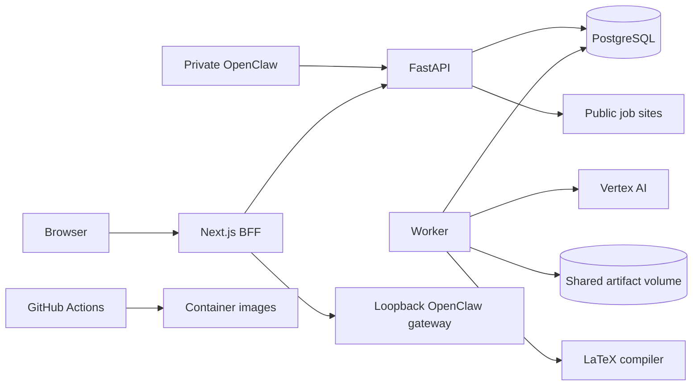

# Security, privacy, and production-readiness audit

## Scope and verdict

No confirmed P0 vulnerability was found. The current loopback Compose stack is
a sound production-like demo baseline. It is not a public-production platform:
edge controls, least-privilege runtime roles, automated retention, recoverable
backups, worker telemetry, and a deployable hosting target remain absent.

The dependency and static-security baseline is healthy. Frontend `npm audit`
reported zero vulnerabilities; the production lock audit and pinned CI actions
passed. Next.js 16.2.10 is beyond the affected ranges for the reviewed middleware
authorization-bypass advisory and includes the reviewed React Server Components
security fixes. Scanner references to `NEXT_PUBLIC_CLERK_PUBLISHABLE_KEY` were
false positives: Clerk documents publishable keys as browser-safe while the
secret key remains server-side. This does not reduce the need to rotate a key
if a server secret is ever exposed.

Sources checked on 2026-07-10:

- [Clerk environment variables](https://clerk.com/docs/guides/development/clerk-environment-variables)
- [Clerk key rotation](https://clerk.com/docs/guides/secure/rotate-api-keys)
- [Next.js middleware authorization bypass advisory](https://github.com/advisories/GHSA-f82v-jwr5-mffw)
- [Next.js RSC security advisory](https://github.com/vercel/next.js/security/advisories/GHSA-9qr9-h5gf-34mp)
- [Next.js support policy](https://nextjs.org/support-policy)

## Repository-specific threat model

### Assets

- original resumes, extracted text, contact details, employment history, and
  job-search intent;
- reviewed job snapshots, match reports, accepted drafts, applications,
  approvals, and LangGraph checkpoints;
- Clerk sessions, trusted-proxy HMAC secret, OpenClaw bearer, Vertex identity,
  PostgreSQL credentials, and signing configuration;
- plan, subscription, usage, provider-cost, and audit records;
- PostgreSQL data, shared artifacts, backups, images, and service availability.

### Actors and capabilities

| Actor | Assumed capability |
|---|---|
| Anonymous internet attacker | Reach a future public Next.js edge; send malformed, large, and repeated requests |
| Authenticated free tenant | Control uploads, filenames, job text/URLs, IDs, operation timing, and request volume |
| Malicious job site | Control DNS, redirects, HTML, content size, and JavaScript rendered by optional Chromium fallback |
| Session/signature thief | Replay a captured user session, OpenClaw bearer, or short-lived internal signature |
| Compromised runtime | Read its environment, mounted volume, network, and database privileges |
| Operator error/failure | Deploy a bad migration, lose a volume, stop a worker, or misconfigure secrets |

The threat model assumes no host/cloud/database-administrator compromise, no
HMAC forgery without the secret, and private network placement for FastAPI,
PostgreSQL, and OpenClaw. Those are deployment requirements, not controls proven
by this repository.

### Trust boundaries

1. Browser to Next.js: Clerk or an upstream signed identity; HTTPS is assumed
   but not implemented here.
2. Next.js to FastAPI: method/path-bound HMAC identity over private HTTP.
3. FastAPI/worker/migrator to PostgreSQL: currently one credential with broad
   business, checkpoint, and migration capability.
4. FastAPI to public job URL: attacker-selected destination with DNS, redirect,
   peer-IP, content-type, and size controls on the normal HTTP path.
5. Worker to Vertex: consented premium path with redacted evidence and validated
   structured output.
6. Worker/compiler to shared volume: plaintext tenant artifacts, temporary
   files, and local tool execution.

### Existing controls

- `Backend/app/core/production.py:11-45` fails closed on debug, SQLite, unsigned
  identity, weak secrets, schema auto-create, and migration drift.
- `Backend/app/services/auth_signature.py:11-68` binds backend identity to user,
  timestamp, HTTP method, and normalized path.
- Repositories scope reads by `user_id`; cross-tenant tests are common.
- `file_storage.py` and `resume_parser.py` bound upload size, signature, DOCX
  expansion, PDF pages, and extracted characters.
- `job_parser.py` validates every normal-fetch DNS/redirect hop and the connected
  peer, rejects private/link-local destinations, and limits bytes/content.
- LangGraph requires explicit consent and effective plan eligibility, treats
  job text as untrusted data, validates structured results, redacts contact
  details, and revision-binds approval with SHA-256.
- The LaTeX template is fixed and values are escaped; compilation has timeout,
  output-size, and executable allowlisting controls.
- Containers run non-root; actions, base images, and production dependencies are
  pinned; CI includes dependency, migration, browser, container, and Compose gates.
- Audit payload sanitization redacts token/secret/contact-like keys, and privacy
  cleanup does not follow tenant-storage symlinks.

### Highest-value abuse paths

| Path | Current exposure | Required mitigation |
|---|---|---|
| Large/repeated JSON, uploads, and previews exhaust memory/disk/outbound capacity | Per-file limits exist; edge/user/storage budgets do not | Bounded BFF body reader, ingress/user rate limits, storage/count quotas, preview concurrency, `413/429`, metrics |
| DNS rebinding targets internal services through optional Chromium fallback | Browser cannot verify connected peer; production default is disabled | Keep disabled publicly or isolate behind an egress proxy/namespace that denies private and metadata ranges |
| Runtime compromise becomes all-tenant/schema compromise | API, worker, migrator, and checkpoints share a DB credential | Separate roles and secrets; API/worker cannot DDL; checkpoint schema grants only where required |
| Captured trusted signature is replayed | Timestamp and route binding reduce scope; nonce use is absent | Short TTL, TLS on every hop, audience/nonce binding, used-nonce rejection for high-risk mutations |
| Inactive premium row triggers paid model work | Closed by this audit batch | Preserve centralized effective-entitlement tests; define trial/grace policy before billing |
| Dead worker leaves API healthy and jobs stalled | API readiness checks DB/migrations, not worker/queue | Durable heartbeat, oldest-queue-age/dead-letter metrics, alerts, correlated structured logs |
| Retention window is never invoked | Only tenant manual endpoint calls purge | Scheduled operator workflow with locks, tombstones, receipts, lag alert |
| Volume/migration loss cannot be restored | Runbook says to back up; no executable drill | Encrypted automated backup/PITR, artifact policy, RPO/RTO, clean-environment restore test |
| OpenClaw bearer is replayed or production auth fails | Client sends bearer only; production tenant auth requires signed headers; synchronous path | Keep private; add dedicated service identity, sender-to-tenant mapping, required allowlist/rate limit, durable idempotent operations |
| Retried sync export consumes another quota event | PDF is durable; Markdown/DOCX/LaTeX are not idempotent | Require revision-bound `Idempotency-Key` and return one usage/audit result per key |

## Prioritized security and privacy findings

### SEC-01 — P1 — Missing edge and tenant abuse budgets

`Frontend/src/app/api/jobs/preview/route.ts` and mutation BFF routes buffer JSON
bodies. Uploads are individually bounded, but user file count, stored bytes,
application count, and preview rate are not. Before public launch, enforce both
edge/IP and authenticated-user limits; edge limits alone do not prevent an
authenticated tenant from filling the shared volume.

### SEC-02 — P1 — Runtime roles and secrets are over-broad

`docker-compose.yml` gives migrator, API, and worker the same PostgreSQL
credential, and processes receive secrets they do not all use. Split migrator,
application, worker, and checkpoint roles; add tests proving runtime roles
cannot DDL or read outside their required schemas. Inject secrets from a manager
and validate an allowlist per process.

### PRIV-01 — P1 — Privacy lifecycle is incomplete

The backend can delete reports, resumes, and accounts, but there is no BFF/UI
privacy center. Account deletion also permits the identity provider session to
recreate the application user on the next request. Add recent re-authentication,
an external-ID deletion tombstone, sign-out/session revocation semantics, a
portable account export, and user-visible deletion receipts.

### PRIV-02 — P1 — Sensitive data is duplicated without repository-defined encryption

Original files, extracted profiles/text, and generated PDFs span PostgreSQL and
named volumes. A real hosting design must provide encryption at rest and in
backup, least-privilege object access, lifecycle policy, and deletion verification.
Deleting original binaries after successful parsing is a product/legal decision
that should be evaluated, not silently introduced.

### OPS-01 — P1 — Worker and queue health are invisible

`Backend/app/workers/run.py` emits `extra` fields, but the plain formatter in
`Backend/app/core/logging.py` drops them. The worker has no Compose healthcheck
or API-visible heartbeat. Add JSON logs with request/operation/worker IDs,
heartbeat and queue-lag state, dead-letter/lease/provider metrics, and alert/runbook
links. Kill and hang the worker in a test and require visible degradation.

### OPS-02 — P1 — Backup/restore is not operationalized

`Docs/DEPLOYMENT.md` has prudent instructions but no automated encrypted backup,
retention, artifact recovery, RPO/RTO, or restore script. Production readiness
requires a clean-environment restore that verifies migrations, tenant counts,
artifact hashes, and `/ready`.

### OPS-03 — P1 — No public deployment platform is defined

The repo has no TLS ingress, WAF/rate limiter, secret manager, private network,
artifact registry, IaC, staging promotion, or rollback automation. Select a
managed target before implementing provider-specific files. Keep PostgreSQL and
FastAPI private, deploy immutable images by digest, run migrations as a separate
pre-deploy job, then smoke-test and support one-click rollback.

### SEC-03 — P2 — Browser hardening and public health are incomplete

Security headers include `nosniff`, frame denial, referrer policy, and a
permissions policy. Add a tested Clerk-compatible CSP and HSTS at TLS ingress.
`/api/health` currently reveals the internal backend URL and environment; expose
only a minimal public status while retaining detailed authenticated/operator
diagnostics.

### SEC-04 — P2 — Parser/compiler process isolation needs a production policy

Command-level controls are good, but the worker still shares database, volume,
network, and host resources. Use a read-only root filesystem, tempfs workspace,
dropped capabilities, `no-new-privileges`, seccomp, CPU/memory/PID limits, and
deny-by-default egress. Separate export-worker privilege only if measurements
justify the operational split.

## Production launch controls

### Required before public multi-tenant launch

1. Select and codify a deployment target with TLS, private backend/database,
   secret management, immutable images, staging, smoke tests, and rollback.
2. Add bounded bodies, authenticated-user and edge rate limits, storage quotas,
   preview budgets, and egress restrictions.
3. Split database/runtime privileges and container secrets.
4. Automate retention and expose safe account export/deletion.
5. Add worker heartbeat, structured telemetry, queue/provider alerts, and
   incident runbooks with ownership.
6. Implement encrypted backup/PITR and pass a restore drill with agreed RPO/RTO.
7. Add PostgreSQL integration races for quota, approval/cancel, finalization,
   and privacy cleanup.
8. Keep OpenClaw private until its production tenant/auth/idempotency contract is
   explicit and tested.
9. Publish founder/legal-approved privacy policy, terms, retention/deletion
   disclosure, AI/provider disclosure, and support/security contact.

### Suggested initial service objectives

These are starting hypotheses, not measured commitments:

- API availability: 99.9% monthly after a public target exists.
- p95 BFF/API latency excluding queued analysis: below 750 ms.
- operation queue start: p95 below 60 seconds under planned beta load.
- failed/dead-lettered operations: alert on any sudden rate increase and any
  item older than the support response target.
- retention deletion lag: no eligible item beyond the approved grace window.
- restore: define RPO/RTO with the founder and hosting provider, then drill it.

Do not publish these as customer promises until load, incident, and restore
evidence supports them.

## Incident and operational minimum

- one owner and escalation path for auth, queue, provider, database, and privacy
  incidents;
- dashboards for request rate/errors/latency, queue age/depth, worker heartbeat,
  leases/retries/dead letters, provider latency/cost, disk/storage, DB saturation,
  and deletion lag;
- redacted structured logs with request, tenant-surrogate, operation, and worker
  correlation IDs—never resume/JD/generated text;
- runbooks for failed migration, dead worker, provider outage, leaked secret,
  storage exhaustion, backup restore, and privacy deletion failure;
- a release checklist that verifies migrations, readiness, smoke flows, alert
  delivery, and rollback before promotion.
